# Playwright Java 源码分析

1. 安装浏览器 启动类 `com.microsoft.playwright.CLI`
2. 代码生成器 Codegen 启动类 `com.microsoft.playwright.CLI` `mvn exec:java -e -D exec.mainClass=com.microsoft.playwright.CLI -D exec.args="codegen demo.playwright.dev/todomvc"`
3. 经过调试，CLI 最后启动的是，`node.exe package/cli.js`，这个 node.exe 是 playwright 安装的临时的  
   `C:\Users\ZHOUHU~1\AppData\Local\Temp\playwright-java-16218301494273050933\node.exe`，而且每次运行完后，里面的内容会被清空，说明只是临时文件  
   使用 `node.exe package/cli.js ...` 效果一样，所以 CLI 的核心源码，还得去看 node 的代码，为了方便分析，这里保留的一份在 `playwright-java-11522379322745295827`，每次运行 随机数字都不一样，忽略数字  
   另外 node.exe 文件太大，换成空文件 node.exe
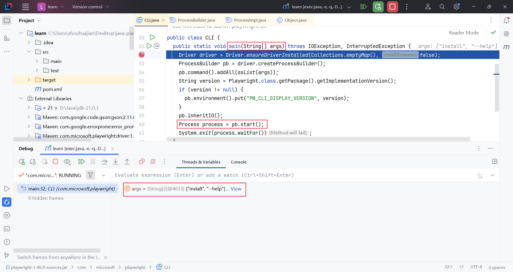
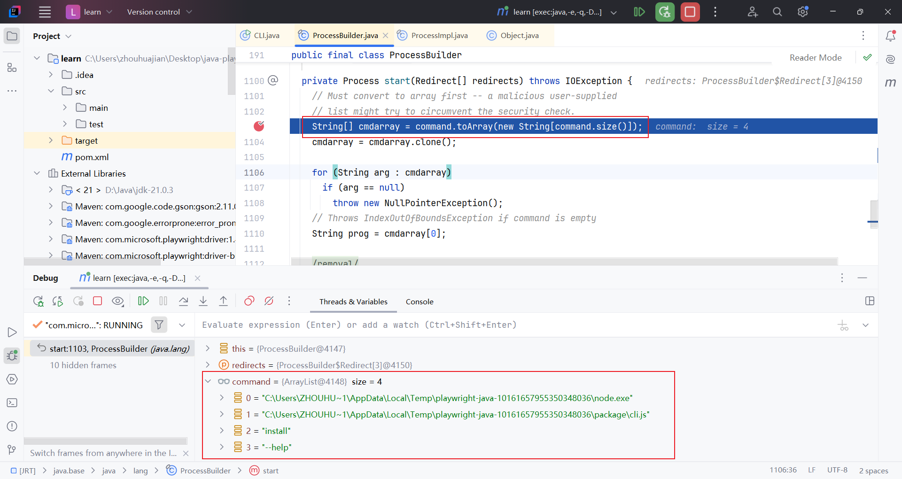
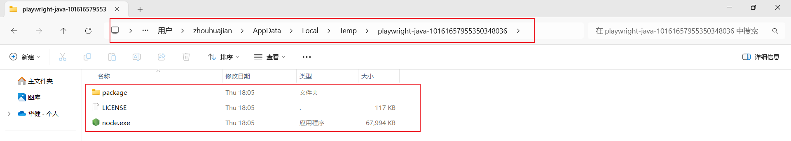
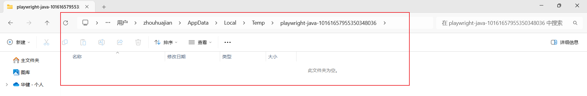
4. 安装浏览器位置 `PLAYWRIGHT_BROWSERS_PATH` 在 playwright-java 源码没看到使用的地方，在 node 代码可以看到
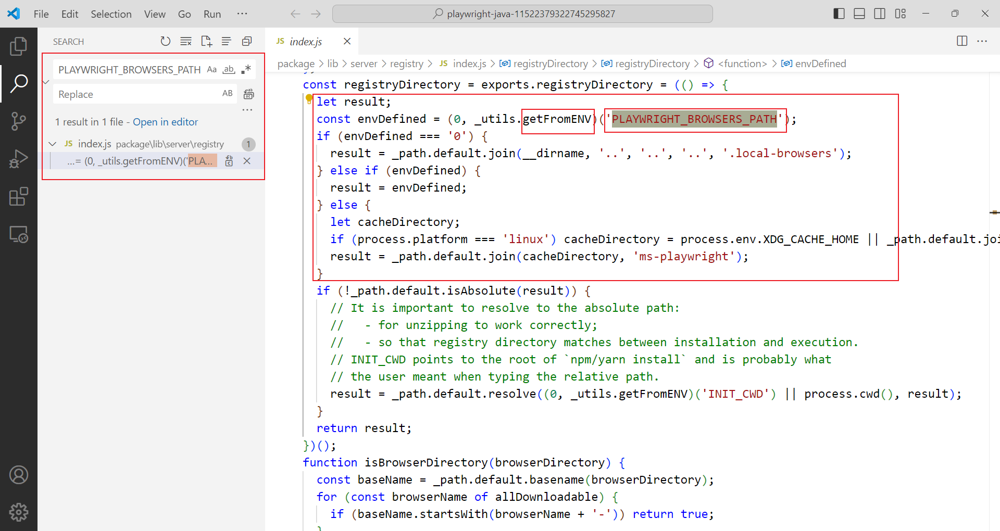
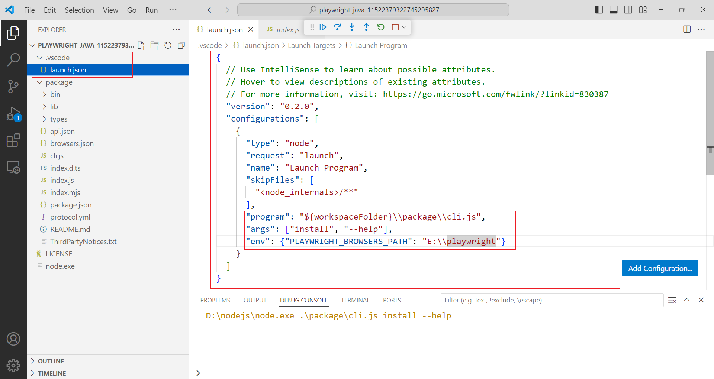

5. 浏览器启动过程，还是借助的 `node.exe` `playwright-java-16218301494273050933` 启动 Node 服务，并一直与之通信
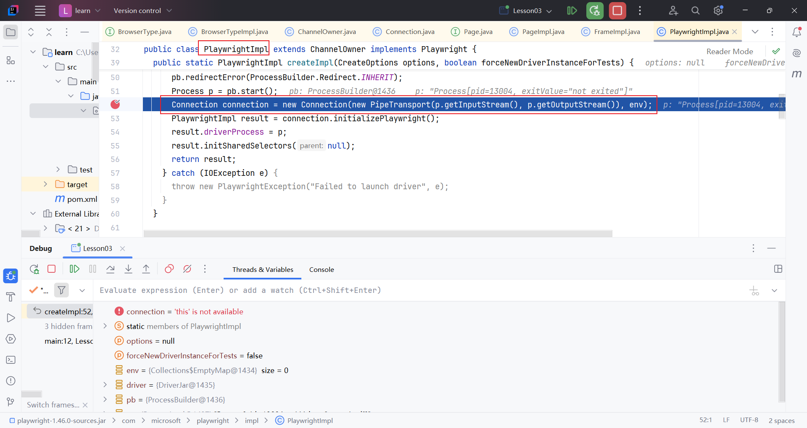
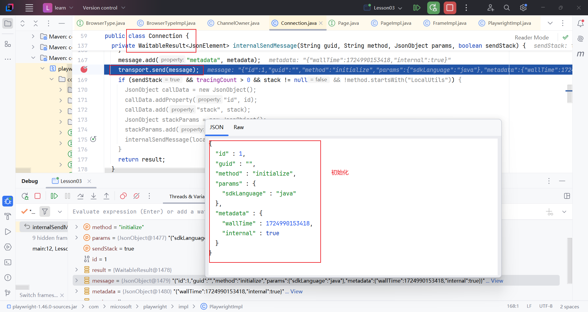
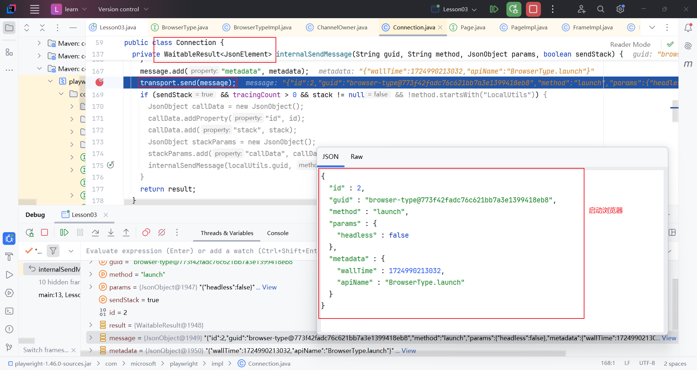
```text
PS C:\Users\zhouhuajian> Get-Process -Name node | Format-List *


Name                       : node
Id                         : 13004
PriorityClass              : Normal
FileVersion                : 20.16.0
HandleCount                : 235
WorkingSet                 : 40488960
PagedMemorySize            : 24043520
PrivateMemorySize          : 24043520
VirtualMemorySize          : 811606016
TotalProcessorTime         : 00:00:00.1562500
SI                         : 44
Handles                    : 235
VM                         : 5106573312
WS                         : 40488960
PM                         : 24043520
NPM                        : 19944
Path                       : C:\Users\ZHOUHU~1\AppData\Local\Temp\playwright-java-13307464314330933463\node.exe
Company                    : Node.js
CPU                        : 0.15625
ProductVersion             : 20.16.0
Description                : Node.js JavaScript Runtime
Product                    : Node.js
__NounName                 : Process
BasePriority               : 8
ExitCode                   :
HasExited                  : False
ExitTime                   :
Handle                     : 3424
SafeHandle                 : Microsoft.Win32.SafeHandles.SafeProcessHandle
MachineName                : .
MainWindowHandle           : 0
MainWindowTitle            :
MainModule                 : System.Diagnostics.ProcessModule (node.exe)
MaxWorkingSet              : 1413120
MinWorkingSet              : 204800
Modules                    : {System.Diagnostics.ProcessModule (node.exe), System.Diagnostics.ProcessModule
                             (ntdll.dll), System.Diagnostics.ProcessModule (KERNEL32.DLL),
                             System.Diagnostics.ProcessModule (KERNELBASE.dll)...}
NonpagedSystemMemorySize   : 19944
NonpagedSystemMemorySize64 : 19944
PagedMemorySize64          : 24043520
PagedSystemMemorySize      : 327768
PagedSystemMemorySize64    : 327768
PeakPagedMemorySize        : 46649344
PeakPagedMemorySize64      : 46649344
PeakWorkingSet             : 53395456
PeakWorkingSet64           : 53395456
PeakVirtualMemorySize      : 866656256
PeakVirtualMemorySize64    : 5161623552
PriorityBoostEnabled       : True
PrivateMemorySize64        : 24043520
PrivilegedProcessorTime    : 00:00:00.0468750
ProcessName                : node
ProcessorAffinity          : 4095
Responding                 : True
SessionId                  : 44
StartInfo                  : System.Diagnostics.ProcessStartInfo
StartTime                  : Fri 11:53:20
SynchronizingObject        :
Threads                    : {14996, 26996, 23988, 876...}
UserProcessorTime          : 00:00:00.1093750
VirtualMemorySize64        : 5106573312
EnableRaisingEvents        : False
StandardInput              :
StandardOutput             :
StandardError              :
WorkingSet64               : 40488960
Site                       :
Container                  :

```
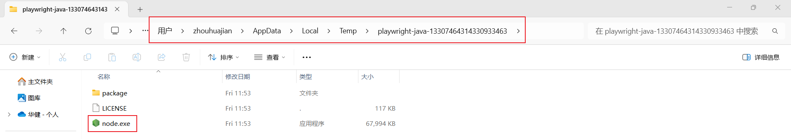
6. 源码中有 driver 的概念，其实就是 `node.exe package/cli.js run-driver` 启动的进程

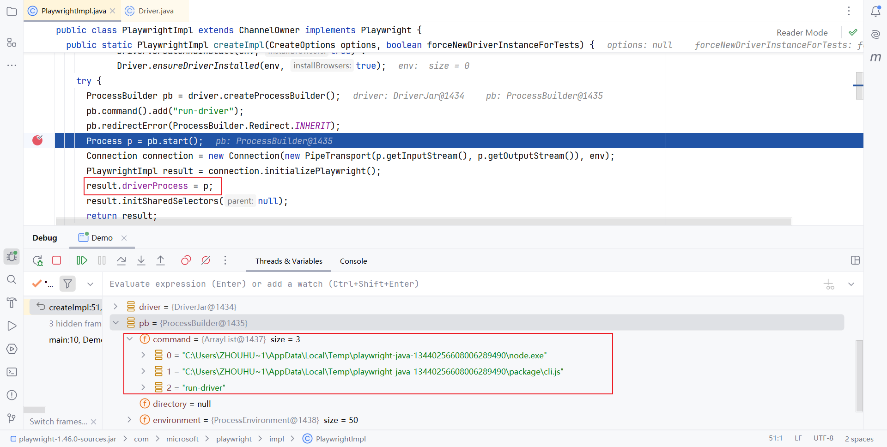