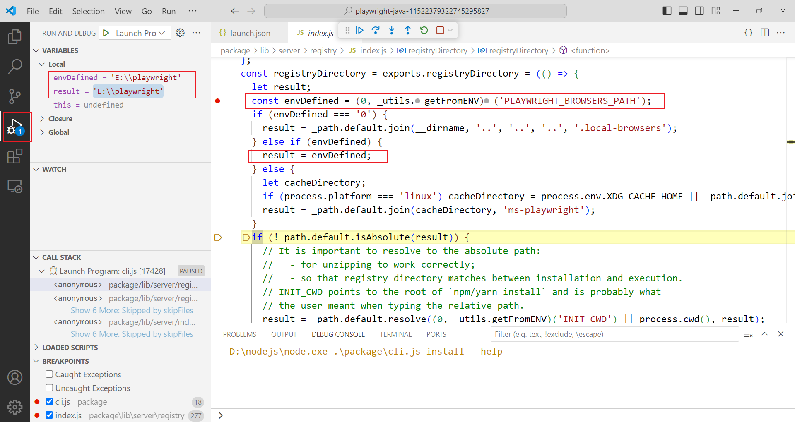

# Playwright Java 源码分析

1. 安装浏览器 启动类 `com.microsoft.playwright.CLI`
2. 代码生成器 Codegen 启动类 `com.microsoft.playwright.CLI` `mvn exec:java -e -D exec.mainClass=com.microsoft.playwright.CLI -D exec.args="codegen demo.playwright.dev/todomvc"`
3. 经过调试，CLI 最后启动的是，`node.exe package/cli.js`，这个 node.exe 是 playwright 安装的临时的  
   `C:\Users\ZHOUHU~1\AppData\Local\Temp\playwright-java-16218301494273050933\node.exe`，而且每次运行完后，里面的内容会被清空，说明只是临时文件  
   使用 `node.exe package/cli.js ...` 效果一样，所以 CLI 的核心源码，还得去看 node 的代码，为了方便分析，这里保留的一份在 `playwright-java-11522379322745295827`，每次运行 随机数字都不一样，忽略数字  
   另外 node.exe 文件太大，换成空文件 node.exe

4. 安装浏览器位置 `PLAYWRIGHT_BROWSERS_PATH` 在 playwright-java 源码没看到使用的地方，在 node 代码可以看到

